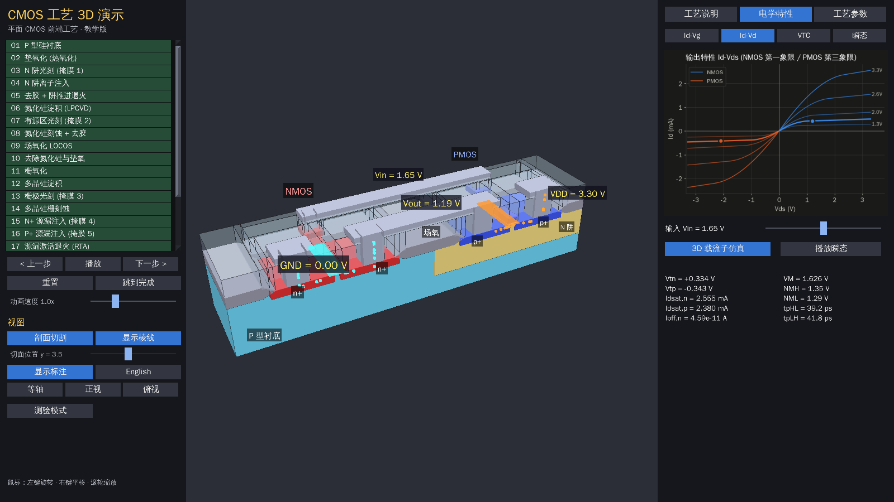
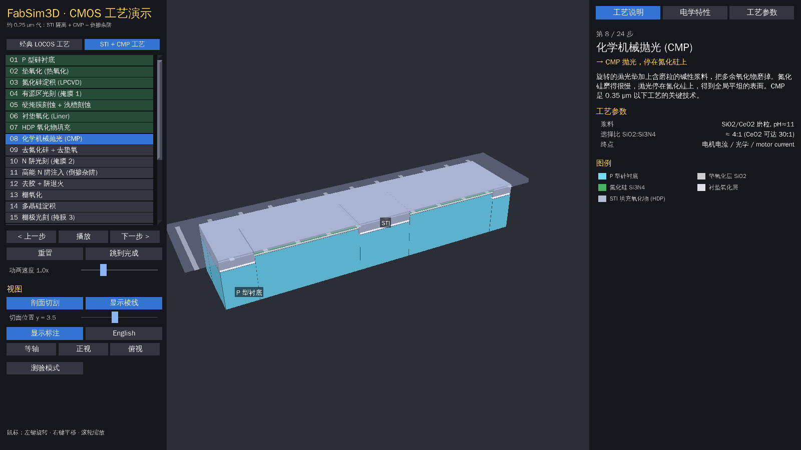
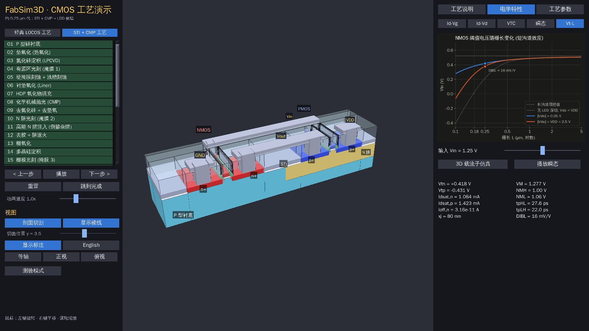

# FabSim3D — CMOS 工艺 3D 教学演示 (Panda3D)

平面 CMOS 前端工艺的交互式 3D 演示：从 P 型硅片开始，经过阱、器件隔离（**LOCOS** 或 **STI + CMP** 两代工艺可切换）、
多晶硅栅、自对准源漏注入、ILD、接触孔和金属 1，最后得到一个 **CMOS 反相器**，并由工艺参数直接推导出它的**电学特性**。







## 运行

```bash
pip install -r requirements.txt
python main.py              # 中文界面
python main.py --lang en    # English UI
python main.py --flow sti   # 直接打开 STI + CMP 工艺
python main.py --size 1920x1080 --fullscreen
```

需要一个带中文字形的字体。程序会自动查找微软雅黑/黑体 (Windows)、苹方 (macOS)、
Noto CJK/文泉驿 (Linux)；也可以把任意 `.ttf/.otf/.ttc` 放进 `fonts/` 目录，
或设置环境变量 `FABSIM3D_FONT=/path/to/font`。找不到字体时会自动切换到英文。

## 界面

| 区域 | 内容 |
|---|---|
| 左栏 | 工艺代切换（经典 LOCOS / STI + CMP）、工艺步骤列表（可以点击跳转）、上一步/播放/下一步、动画速度、剖面切割与切面位置、棱线/标注开关、视角预设、中英切换、测验模式 |
| 中间 | 3D 晶圆模型。左键拖动旋转，右键拖动平移，滚轮缩放。快捷键：← → 切换步骤，空格播放/暂停 |
| 右栏 · 工艺说明 | 当前步骤的原理说明、当前子阶段（涂胶/曝光/显影…）、工艺参数、材料图例 |
| 右栏 · 电学特性 | Id-Vg（对数坐标）、Id-Vd（NMOS 第一象限/PMOS 第三象限）、反相器 VTC、瞬态响应、Vt-L（短沟道效应）；Vin 滑块会在所有图上标出工作点 |
| 右栏 · 工艺参数 | tox、衬底掺杂 Na、N 阱注入剂量、栅长 L、Wn/Wp、VDD、负载 CL，调完立即更新 Vt、曲线和 3D 模型（L 会改变栅极宽度） |

**3D 载流子仿真**：工艺完成后打开，会自动开启剖面，沟道反型层会随 Vin 亮起，
电子（青色）和空穴（橙色）按电流大小流动，终端标签显示实时电压。点“播放瞬态”会用瞬态仿真结果驱动动画。

**测验模式**：每完成一步弹出一道选择题，附带解析，左栏显示得分。

## 工艺流程

左栏顶部可以切换两套工艺，对比隔离技术的演进：

**经典 LOCOS（约 1.0 µm 代，22 步，7 块掩膜）**

1 P 型衬底 → 2 垫氧化 → 3 N 阱光刻 → 4 磷注入 → 5 去胶+阱推进 → 6 Si3N4 淀积 → 7 有源区光刻 →
8 氮化硅刻蚀 → 9 LOCOS 场氧（鸟嘴） → 10 去氮化硅/垫氧 → 11 栅氧化 → 12 多晶硅淀积 → 13 栅极光刻 →
14 多晶硅栅刻蚀 → 15 N+ 源漏注入 → 16 P+ 源漏注入 → 17 RTA 激活退火 → 18 BPSG 层间介质 →
19 接触孔 → 20 溅射铝 → 21 金属刻蚀 → 22 完成（反相器）

**STI + CMP + LDD（约 0.25 µm 代，28 步）**：先做隔离再做阱，源漏采用 LDD + 侧墙结构

1 P 型衬底 → 2 垫氧化 → 3 Si3N4（硬掩膜 + CMP 停止层） → 4 有源区光刻 → 5 硬掩膜刻蚀 + **浅槽刻蚀** →
6 **衬垫氧化** → 7 **HDP 氧化物填槽** → 8 **CMP 抛光（停在氮化硅上）** → 9 去氮化硅/垫氧（STI 回刻） →
10 N 阱光刻 → 11 **高能注入（倒掺杂阱）** → 12 去胶 + 低热预算退火 → 13 栅氧化 → 14 多晶硅淀积 →
15 栅极光刻 → 16 栅刻蚀 → 17 **N- LDD 注入** → 18 **P- LDD 注入** → 19 **侧墙介质保形淀积** →
20 **侧墙回刻（无掩膜）** → 21 **N+ 源漏（以侧墙对准）** → 22 **P+ 源漏** → 23 RTA →
24 **ILD 淀积 + CMP** → 25–28 接触孔、金属、完成

切换工艺代时会套用该代的典型参数：1 µm 代用 tox 20 nm、VDD 5 V、L 1 µm；0.25 µm 代用 tox 5 nm、VDD 2.5 V、L 0.25 µm。

两套工艺的电学差异：

- **短沟道效应**：Vt roll-off、DIBL 和速度饱和。结深越浅越弱，所以 LDD 能明显压低 DIBL。“电学特性 → Vt-L”图会画出 Vt 随栅长的变化，同时给出“无 LDD 深结”的对比线。
- **窄宽度效应**：隔离方式会影响阈值电压。LOCOS 的鸟嘴让窄管 |Vt| 升高，STI 的槽角电场集中让 |Vt| 降低（反窄宽度效应）。
把“工艺参数”页里的 Wn 调小，就能在两套工艺之间看到这个差别，场氧/STI 那一步的参数表里也会显示 ΔVtn。

动画效果包括：薄膜生长/淀积、旋涂光刻胶、掩膜版与紫外光线、曝光区变色、显影溶解、
等离子体刻蚀粒子、离子注入粒子（会被光刻胶和栅极挡住）、高温退火发光、LOCOS 上下双向生长、
CMP 抛光垫贴着表面边磨边下降。

> 纵向尺寸做了夸张处理（薄膜被放大），以便观察。阱接触、钝化层、多层金属等省略。

## 电学模型 (`fabsim3d/device_model.py`)

- **阈值电压**：Vt = Vfb ± 2φF ± Qdep/Cox，采用双掺杂多晶硅栅（NMOS 用 n+ poly，PMOS 用 p+ poly），并计入固定氧化层电荷
- **N 阱浓度**：Nd = 注入剂量 / 阱深 (2 µm)
- **漏电流**：强反型时是 Level-1 平方律，用 EKV 插值平滑过渡到亚阈值区，并加入沟道长度调制 λ = 0.05/L
- **反相器**：VTC 用向量化二分法求解 Idn = Idp，并提取 VM、VIL/VIH、噪声容限和增益
- **瞬态**：用 RK2 积分 CL·dVout/dt = Idp − Idn，提取 tpHL/tpLH
- **二级效应链 `EFFECTS`**：根据工艺的特征集合（如 `{"locos", "sce"}`、`{"sti", "cmp", "ldd", "sce"}`）依次修正器件参数：
  - **窄宽度效应**：LOCOS 让 |Vt| 升高，STI 让 |Vt| 降低
  - **短沟道效应**（`sce`）：Vt roll-off（Yau 电荷分享模型）、DIBL（σ = 0.6·exp(−L/2l)，l = √(εsi/εox·tox·xj)）、速度饱和（Ec = 2vsat/µ）。有 `ldd` 时结深 xj = 80 nm，没有时 xj = 250 nm
  - 如果 roll-off 把 Vt 压到负值，器件变成常开（穿通），模型会如实体现
- **Vt-L 曲线**：分别在低 Vds 和 Vds = VDD 下画 Vt，两线之差就是 DIBL

## 代码结构

```
main.py                       入口 (命令行参数, 无界面截图)
fabsim3d/app.py               Panda3D 应用：三栏 UI、相机、步骤控制、测验、电学面板
fabsim3d/scene.py             晶圆渲染、动画、粒子、CMP 抛光垫、剖面、3D 标注、载流子
fabsim3d/process_core.py      工艺引擎：晶圆状态、动作、Flow/Step/Phase、故障钩子、掺杂记录
fabsim3d/flows/__init__.py    工艺代注册表 FLOWS
fabsim3d/flows/locos.py       经典 LOCOS 流程
fabsim3d/flows/sti.py         STI + CMP 流程（后半段复用 LOCOS 的步骤）
fabsim3d/geometry.py          x-z 截面凸多边形沿 y 拉伸的实体、矩形运算、保形淀积
fabsim3d/device_model.py      器件与反相器模型 + 二级效应链 (纯 numpy)
fabsim3d/plots.py             matplotlib → Panda3D 纹理
fabsim3d/materials.py         材料颜色与名称
fabsim3d/i18n.py              中英文字符串
```

**工艺动作**（`process_core`）：`deposit`（保形/平坦化淀积）、`coat`、`expose`、`develop`、`pattern`（薄膜刻蚀）、
`recess`（刻进已有实体，如硅槽）、`cmp`（平坦化）、`spacer_deposit` / `spacer_etchback`（侧墙）、`implant`、`anneal`、
`strip`、`recolor`、`replace_layer(requires=...)`。

### 扩展接口

| 接口 | 用途 | 怎么用 |
|---|---|---|
| `flows.FLOWS` + `Flow.defaults` | 新工艺代（如 Salicide、HKMG） | 新建 `flows/xxx.py` 导出 `FLOW`，在 `flows/__init__.py` 注册；左栏会自动多出一个按钮。可以用 `dataclasses.replace` 复用已有步骤 |
| `Flow.features` + `device_model.EFFECTS` | 已有：窄宽度效应、短沟道效应；可以继续加：硅化物/LDD 串联电阻、栅隧穿漏电 | 写一个 `effect(p, mos, features) -> Mosfet` 加进 `EFFECTS`，在对应流程的 `features` 里打上标记 |
| `process_core.Faults` | 故障工艺教学模式 | `make_ctx(p, flow, Faults(misalign={"POLY": (0.5, 0)}, skip=frozenset({"nplus"})))`：带 `mask=` 的光刻/刻蚀会按掩膜名错位，自对准注入会跟着实际栅极走；被跳过的步骤不执行，依赖它的退火也不会凭空生成杂质区 |
| `Wafer.dopants` / `Wafer.thermal` | 掺杂浓度热图、注入深度分布、热预算 | 每次 `implant(..., species=, dose=, energy_kev=)` 和 `anneal(T, t)` 都会留下记录（步骤、离子、剂量、能量、区域、温度、时间） |

## 测试

```bash
pip install pytest
python -m pytest -q        # 模型(含短沟道效应) + 两套工艺几何 + 故障/记录接口 + 离屏 GUI 冒烟测试
```

无界面截图（文档和调试用）：

```bash
python main.py --shot out.png --step 21 --tab elec --sim --vin 1.2 --plot idvd
python main.py --shot litho.png --step 2 --anim 2.0     # 截取第 3 步动画中途 2 秒的画面
python main.py --shot cmp.png --flow sti --step 7 --anim 1.2   # STI 流程的 CMP 动画
python main.py --shot vtl.png --flow sti --step 27 --tab elec --plot vtl   # Vt-L 曲线
```
